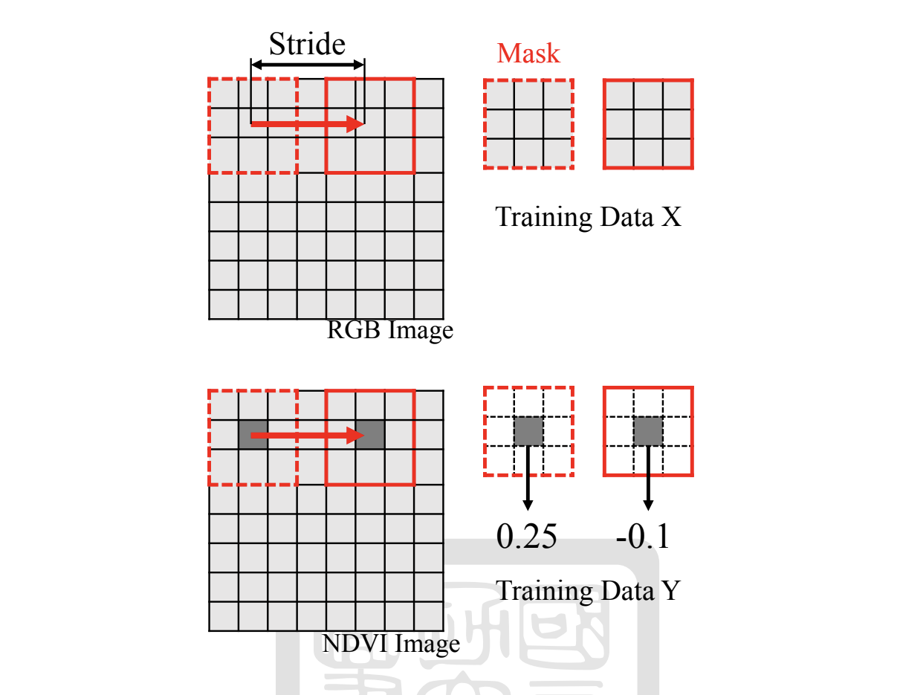

# NDVI-prediction
The purpose of this project regard NDVI(Normalized Difference Vegetation Index) as the index of the crop growth and health situstion and predict the NDVI by using RBG images.
This project use the visible wavelength colors to be input and compute by the CNN to predict the NDVI index.

## Data
`Dataset.py` makes the NDVI images and resize the images by RGB images.

  

## Visible_VI
Before predict the NDVI by the CNN model, i try to use different visible indics to replace the NDVI, `visible_VI.py` is the UI to show all the VI images and compare each other.

  

## Training/Testing
`train.py` will create a model file `model.h5` and `test.py` will input the test images and the `model.h5` to predict the NDVI images.
`train.py` will import `model.py`,which build the model architecture, and can change the architecture by change the `model.py`.

  

## Comparison
`comparison.py` is used to compare the result of different architecture model.

  

  

